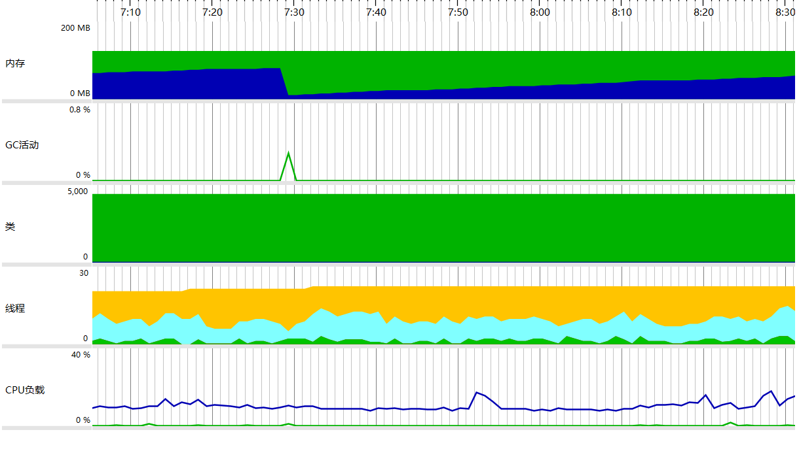
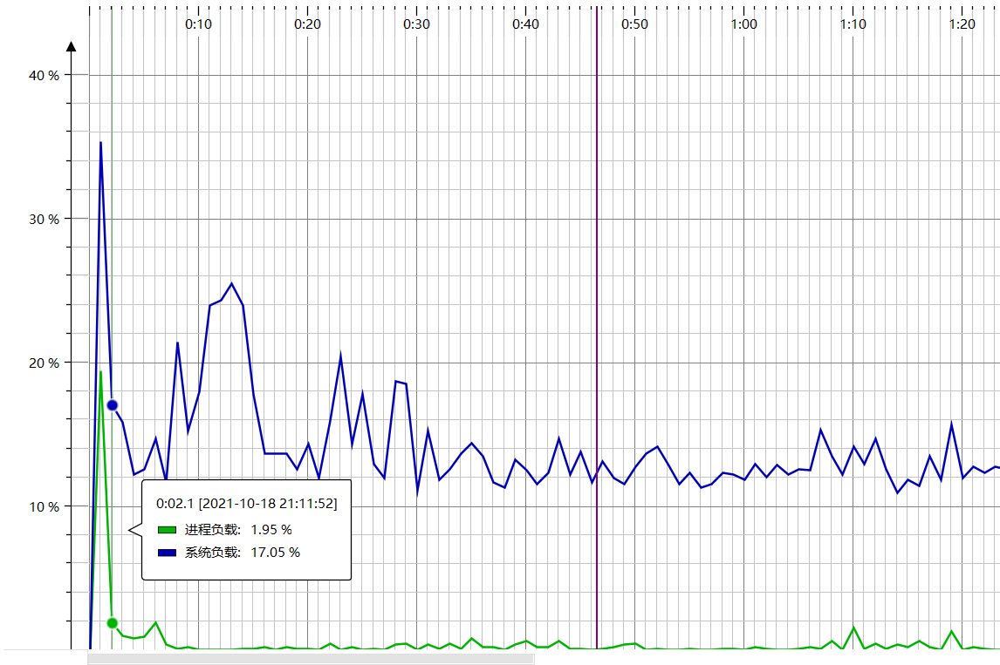

| 这个作业属于哪个课程 | [班级链接](https://edu.cnblogs.com/campus/gdgy/InformationSecurity1912-Softwareengineering) |
| :------------------: | :----------------------------------------------------------: |
|  这个作业要求在哪里  | [作业要求链接](https://edu.cnblogs.com/campus/gdgy/InformationSecurity1912-Softwareengineering/homework/12147) |
|    这个作业的目标    |          结对作业（写一个能自动生成四则运算的程序）          |

### 一、Team

**3119005475   王智荣**   

**3119005463**   **孔繁威**

**Github：**https://github.com/wangzr123/Arithmetic.git


### 二、PSP表格

​      

### 三、效能分析

- **概况**

  

- **CPU负载**

  

- **时间占比**

  

- **空间占比**

  

### 四、设计实现过程

- **四个类**

  1.Fraction。最关键的类，用这个类可以实现对分数的表达，但这里的分数是假分数。而且还提供了五个特别的成员方法，分别是simplify--约分，add--加法，minus--减法，multiply--乘法，divide--除法。当需要进行运算的时候，可以直接调用这几个成员方法，不用再做其他运算了。

  2.GoFile类。把生成出来的题目和结果写入文件中，最简洁的类，有两个函数。StringToFile，字符流写入文件中，现在是把题目的字符串形式写入文件，地址固定为生成题目的文件。ResultToFile，也是字符流写入文件，这里是将结果写入文件，其实和StringToFile函数一样的，但是路径换成了结果的文件。

  3.Arithmetic。主函数类，程序的入口，里面实现了让用户输入参数生成四则运算的功能和调用函数把四则运算表达式写入文件的功能。有两个函数，FtoT函数是将假分数化简成真分数或者带分数或者整数，输入的是Fraction对象，返回的形式是字符串。newExc函数是生成一个随机的四则运算表达式，并计算出结果，输入的是一个结果的最大值，输出是一个字符串形式的四则运算，里面也实现了把结果写入文件的功能。

  4.TestArithmetic类。测试类，测试了10个例子，都通过了。

### 五、代码说明

- **表达分数的类**

  思路：一个数由分子和分母两部分组成，所以需要两个参数，实现这个类就可以实现对分数的表达，分子和分母都是Integer引用数据类型，因为后面的加减乘除运算要使用到Integer提供的方法，当实现的时候可以用int类型来实现，因为有自动装箱功能，里面包含了约分功能，但是约分之后的是假分数，所以要做进一步处理。

```java  
public class Fraction {

        private Integer numerator; // 分子;
        private Integer denominator; // 分母
        /**
         * 构造器
         */
        public Fraction() {
        }
        public Fraction(Integer numerator, Integer denominator) {
            this.numerator = numerator;
            this.denominator = denominator;
        }
        public Integer getDenominator() {
            return denominator;
        }
        public void setDenominator(Integer denominator) {
            this.denominator = denominator;
        }
        public Integer getNumerator() {
            return numerator;
        }
        public void setNumerator(Integer numerator) {
            this.numerator = numerator;
        }
        /**
         * 求最大公约数
         *
         * @return
         */
        private int getGCD(int a, int b) {
            int max = Math.max(a, b);
            int min = Math.min(a, b);
            int mod = max % min;
            if (mod == 0) {
                return min;
            } else {
                return this.getGCD(mod, min);
            }
        }
        /**
         * 简化和约分
         *
         * @return
         */
        public Fraction simplify() {
			// 格式化
            if (this.numerator == 0) {
                this.denominator = 1;
                return this;
            } else if (this.denominator * this.numerator > 0
                    && this.denominator < 0) {
                this.denominator = Math.abs(this.denominator);
                this.numerator = Math.abs(this.numerator);
                return this;
            } else if (this.denominator < 0) {
                this.denominator = Math.abs(this.denominator);
                this.numerator = -this.numerator;
                return this;
            }
		    // 约分
            int gcd = this.getGCD(Math.abs(denominator), Math.abs(numerator));
            if (gcd == 1) {
                return this;
            } else {
                this.denominator = this.denominator / gcd;
                this.numerator = this.numerator / gcd;
                return this;
            }
        }
```

- **把假分数转换成真分数或者整数或者带分数的类**

  传递一个Fraction对象（分数），对分子和分母进行数学的判断，很容易就化简成成真分数或者整数或者带分数，当我这里为了方便，就返回了字符串的形式。

```java
private static String FtoT(Fraction fraction) {
        int i = 0;
        int Numerator = fraction.getNumerator();
        int Denominator = fraction.getDenominator();
        //分子大于分母
        while (Numerator >= Denominator){
            Numerator -= Denominator;
            i++;
        }
        if(i==0 && Numerator!=0){
            //真分数
            return Numerator + "/" + Denominator;
        }else if(Numerator == 0){
            //整数
            return i +"";
        }
        else {
            //带分数
            return i+"`"+Numerator + "/" + Denominator;
        }
    }
```

- **实现四则运算的方法**

  因为是用分数来进行运算的，所以上来先通分，然后就直接使用数学的加减乘除运算，运算之后需要进行化简和约分。

  ```java
  		/**
           * 加法
           *
           * @param fraction
           * @return
           */
          public Fraction add(Fraction fraction) {
              Integer resultDenominator = Math.abs(this.denominator)
                      * Math.abs(fraction.getDenominator());
              Integer resultNumerator = this.numerator * fraction.getDenominator()
                      + this.denominator * fraction.getNumerator();
              Fraction result = new Fraction(resultNumerator, resultDenominator);
              return result.simplify();
          }
          /**
           * 减法
           *
           * @param fraction
           * @return
           */
          public Fraction minus(Fraction fraction) {
              Integer resultDenominator = Math.abs(this.denominator)
                      * Math.abs(fraction.getDenominator());
              Integer resultNumerator = this.numerator * fraction.getDenominator()
                      - this.denominator * fraction.getNumerator();
              Fraction result = new Fraction(resultNumerator, resultDenominator);
              return result.simplify();
          }
          /**
           * 乘法
           *
           * @param fraction
           * @return
           */
          public Fraction multiply(Fraction fraction) {
              Fraction result = null;
              if (this.numerator == 0 || fraction.numerator == 0) {
                  result = new Fraction(0, null);
              }
              Integer resultDenominator = this.denominator
                      * fraction.getDenominator();
              Integer resultNumerator = this.numerator * fraction.getNumerator();
              result = new Fraction(resultNumerator, resultDenominator);
              return result.simplify();
          }
          /*除法
           *
           * @param fraction
           * @return
           */
          public Fraction divide(Fraction fraction) {
              Fraction result = null;
              if (this.numerator == 0) {
                  result = new Fraction(0, null);
              }
              Integer resultDenominator = this.denominator * fraction.getNumerator();
              Integer resultNumerator = this.numerator * fraction.getDenominator();
              result = new Fraction(resultNumerator, resultDenominator);
              return result.simplify();
          }
  ```

### 六、测试运行

- **测试模块代码**

  为什么我的程序是正确的？因为我是先使用的是数值上的运算，并把结果输出，这里的出错概率等于计算机出错概率，然后再把数值和结果转换为字符串写入文件的，如果出错，也是计算机的出错概率。并且我也自己手动计算了很多个题目，都正确。

  ```java
  import org.junit.Test;
  
  public class TestArithmetic {
      /**
       *Test 1:生成1个1以内的题目
       */
      @Test
      public void testFor1_1(){
  
          GoFile.StringToFile(ArithmeticMain.newExc(1));
  
          }
  
      /**
       *Test 2:生成1个5以内的题目
       */
      @Test
      public void testFor1_5(){
  
          GoFile.StringToFile(ArithmeticMain.newExc(5));
  
      }
  
      /**
       *Test 3:生成1个10以内的题目
       */
      @Test
      public void testFor1_10(){
  
          GoFile.StringToFile(ArithmeticMain.newExc(10));
  
      }
  
      /**
       *Test 4:生成5个10以内的题目
       */
      @Test
      public void testFor5_10(){
  
          for ( int i=0; i < 5 ; i++){
              GoFile.StringToFile(ArithmeticMain.newExc(10));
          }
  
      }
  
      /**
       *Test 5:生成100个50以内的题目
       */
      @Test
      public void testFor100_50(){
  
          for ( int i=0; i < 100 ; i++){
              GoFile.StringToFile(ArithmeticMain.newExc(50));
          }
  
      }
      /**
       *Test 6:生成1000个100以内的题目
       */
      @Test
      public void testFor1000_100(){
  
          for ( int i=0; i < 1000 ; i++){
              GoFile.StringToFile(ArithmeticMain.newExc(100));
          }
  
      }
      /**
       *Test 7:生成10000个1000以内的题目
       */
      @Test
      public void testFor10000_10000(){
  
          for ( int i=0; i < 10000 ; i++){
              GoFile.StringToFile(ArithmeticMain.newExc(10000));
          }
  
      }
      /**
       *Test 8:生成500个100以内的题目
       */
      @Test
      public void testFor500_100(){
  
          for ( int i=0; i < 500 ; i++){
              GoFile.StringToFile(ArithmeticMain.newExc(100));
          }
  
      }
      /**
       *Test 9:生成2个1以内的题目
       */
      @Test
      public void testFor2_1(){
  
          for ( int i=0; i < 2 ; i++){
              GoFile.StringToFile(ArithmeticMain.newExc(1));
          }
  
      }
      /**
       *Test 10:生成5000个1000以内的题目
       */
      @Test
      public void testFor5000_1000(){
  
          for ( int i=0; i < 5000 ; i++){
              GoFile.StringToFile(ArithmeticMain.newExc(1000));
          }
      }
  
  }
  ```

- **测试结果**

  

  

### 七、项目小结

W：这次的结对项目是我们两个人第一次以这样子的形式写代码的，一开始有点不习惯，因为想法不是很统一，我想的是比较蠢的一种做法：先随机生成整数的一道题目然后再变成生成很多道题目，然后再生成有分数的很多道题目，然后再计算他们的结果...然后再慢慢改进功能，如此类推。而队友的想法是用比较高深的（二叉树），我对这个不太熟悉，但队友也对这个不熟悉，所以我们最后决定用我的方法。

K：这次的项目让我受益匪浅，结对编程真的要做好前期的沟通，不然意见会有小小的分歧。队友的想法，我觉得挺好的。而且队友的编程能力比我强很多，按他的方法来做比较容易实现该有的功能。在他的身上，我看到了很多闪光点，这都值得我去学习。路漫漫其修远兮，吾将上下而求索。